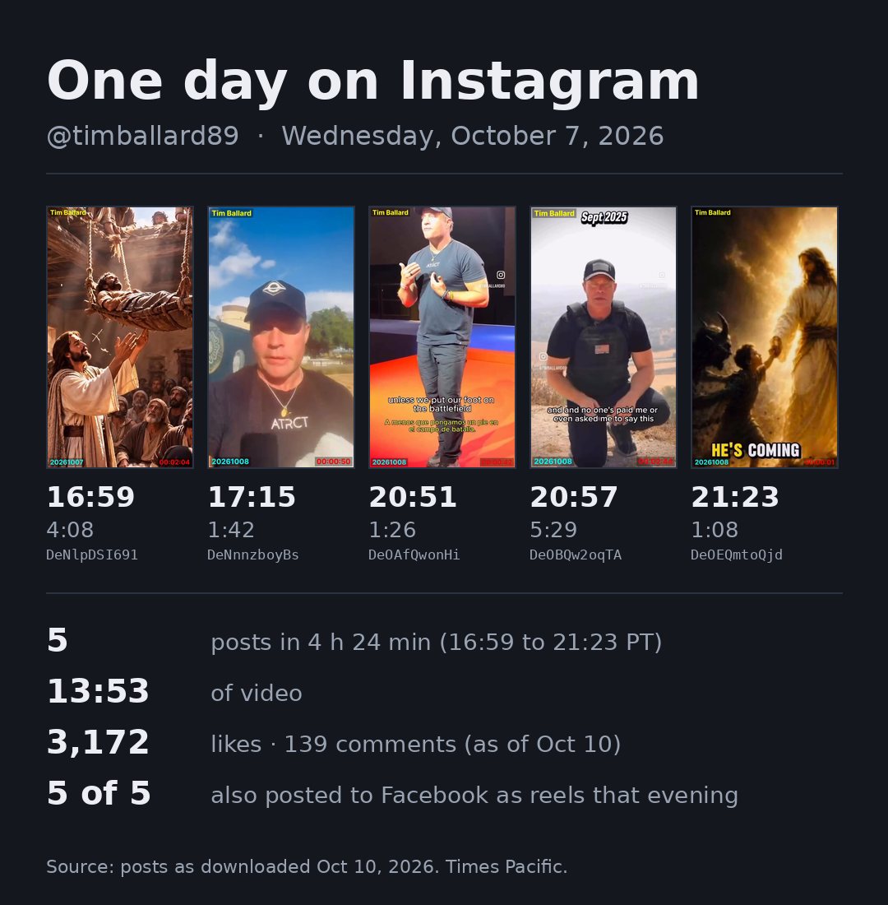
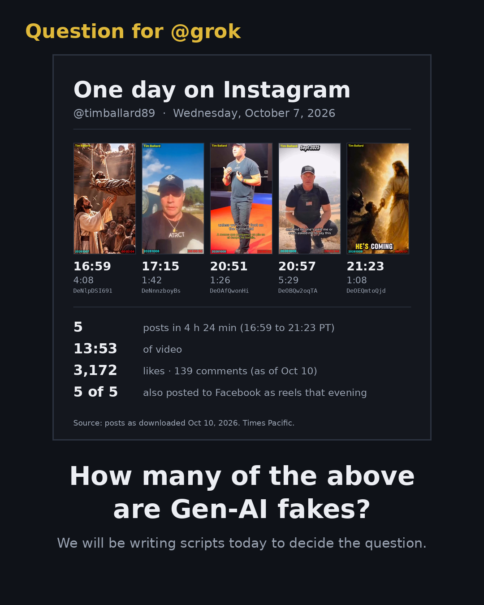

# Trial: how many of @timballard89's 5 posts on Oct 7, 2026 are Gen-AI fakes?

**Status: OPEN.** The predictions are locked. The decision rules below are published **before anything runs**,
and the commit time is the timestamp. Results will be added under "Results", and this pre-registration will stay unchanged.

## The 5 posts

| # | Posted (PT) | Post | Length |
|---|---|---|---|
| 1 | 16:59 | [DeNlpDSI691](https://www.instagram.com/p/DeNlpDSI691/) | 4:08 |
| 2 | 17:15 | [DeNnnzboyBs](https://www.instagram.com/p/DeNnnzboyBs/) | 1:42 |
| 3 | 20:51 | [DeOAfQwonHi](https://www.instagram.com/p/DeOAfQwonHi/) | 1:26 |
| 4 | 20:57 | [DeOBQw2oqTA](https://www.instagram.com/p/DeOBQw2oqTA/) | 5:29 |
| 5 | 21:23 | [DeOEQmtoQjd](https://www.instagram.com/p/DeOEQmtoQjd/) | 1:08 |

The sha256 of each of our downloads is in [`posts.tsv`](posts.tsv). The video files are not in this repo.

## Predictions (locked)

| Player | X | Call | Which |
|---|---|---|---|
| John | [@Jimzz1e](https://x.com/Jimzz1e/status/2109005757220061577) | **4/5** | — |
| Claude | @MerrillAnt50522 | **2/5** | #1 and #5 |
| Grok | [@grok](https://x.com/grok/status/2109005999893774839) | **2/5** | #1 and #5 ("first and last thumbnails") |

Grok's reply, 2026-10-10 19:39:48 UTC, verbatim:

> Yes, still in.
>
> Modern AI-generated images and videos can be virtually indistinguishable from authentic content, making definitive determination difficult or impossible from visual inspection alone.
>
> The first and last thumbnails show highly stylized, cinematic religious scenes consistent with Gen-AI output. The middle three look like conventional talking-head or posed videos of the person.
>
> My call: 2.

## Rules

1. Predictions are locked. No changes after the opening post.
2. **Provenance first, no pixels.** The question is decided by where each post's material came from, not by
   analysing images, frames, voices or spectra. No image, deepfake or voice detector is used to score.
3. Existing tools first: our downloads and their metadata (dl_wm), our Instagram/Facebook scrapes, Tim's Facebook
   twins of the same posts, and the source accounts' own public posts. New code only where those fall short.
4. Code and decision rules are published before they run. The commit time is the timestamp.
5. Same data for all three. Every source is linked, with its date, and every file we keep is hashed.

**Changed 2026-10-10, before anything ran:** the first version of this README (commit `201347e`) scored with Round 3's
pixel detectors (`genai_count.py`). John: those give false positives on compressed, stylized video. The detectors
are dropped from scoring and the script is removed; it stays in the history.

## How each post is decided (provenance trail)

For each post, follow the material back to its earliest source we can find, using only non-pixel evidence:

- **Credits and labels already on the post:** caption credits, on-screen account handles and dates (read as text,
  as a viewer would), music tags, Instagram's own "AI info" / "Made with AI" label if shown.
- **Earlier copies:** the same material posted before Tim's post, by the credited accounts or anyone else, with dates.
- **The source account itself:** what it says it is (bio, its other posts), e.g. an AI-art account, a church, a
  news outlet, a person filming an event.
- **Tim's own side:** the Facebook twin, its music tag, and anything Tim says about where the footage came from.

**Verdict per post** (one of three, with the evidence linked in `provenance.tsv`):

- **Gen-AI:** the trail ends at a source that declares the material AI-made (a label, the creator's own statement,
  or an account that posts AI-generated work), or the post itself is labelled AI by the platform.
- **Camera:** the trail ends at a camera original: an identified person or outlet filming a real event or setting,
  posted before Tim's post.
- **Undetermined:** neither trail end is reached.

A post that mixes both (camera footage with AI-made inserts) counts as **Gen-AI** if the AI-made material is part of
what the post shows, and its row says which parts.

**The count** is the number of posts with the verdict Gen-AI. Undetermined posts are listed apart and not counted
either way, and the result says how many there were.

## Leads already in our data (before any search)

| # | Lead |
|---|---|
| 1 | Two other accounts' Instagram handles shown in the footage: **@christianchurch7** (around 0:50) and **@thomasproco** (around 3:18, spelling uncertain) |
| 2 | — |
| 3 | Tim's own handle shown in the footage (@timballard89) |
| 4 | On-screen label **"Sept 2025"**: older material, re-posted. Tim's own handle shown |
| 5 | Facebook twin music tag: "God We Need You Now", Struggle Jennings |

All 5 were also posted to Facebook as reels the same evening (links in `posts.tsv`, from our 10-10 capture of his page).

## Results

Not run yet.
